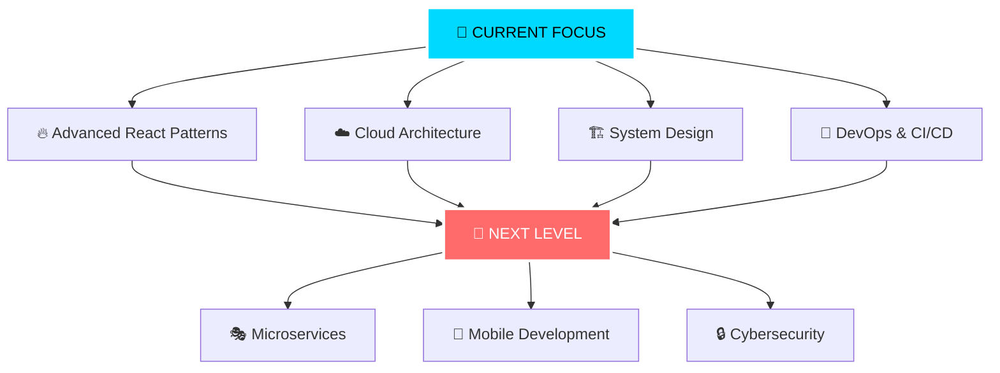

# <div align="center">


<br/>

# 🌟 **MUHAMMAD NADHIF FASICHUL ILMI** 🌟

<div style="font-size: 18px; margin: 20px 0;">
  <strong>🚀 Software Engineer • 💻 Full-Stack Developer • ⚡ Code Architect</strong>
</div>

[](https://git.io/typing-svg)

<br/>

<div align="center">
  
  
  
  
</div>

<br/>


</div>

---

## 🎯 **ABOUT THE DEVELOPER**

<div align="center">

```typescript
class Developer {
  name: string = "Muhammad Nadhif Fasichul Ilmi";
  title: string = "Computer Engineering Student";
  location: string = "Depok, Indonesia 🇮🇩";
  university: string = "Universitas Indonesia";
  
  readonly passions: string[] = [
    "🛠️ Software Engineering",
    "🌐 Full-Stack Web Applications", 
    "🎨 Frontend Development",
    "⚙️ Backend Architecture",
    "📐 Clean Code & Best Practices"
  ];
  
  currentMission(): string {
    return "Building scalable web applications & modern software solutions 🚀";
  }
  
  dailyRoutine(): string {
    return "I turn coffee into code and ideas into web applications! ☕→💻";
  }
  
  getMotivation(): string {
    return "Code is poetry, debug is detective work, deploy is magic! ✨";
  }
}

const nadhif = new Developer();
console.log(nadhif.currentMission());
```

</div>

<div align="center">
  
</div>

---

## ⚡ **TECHNOLOGY ARSENAL**

<div align="center">


### 🎨 **Frontend Mastery**
<p>
  
</p>


### 🔧 **Backend Powerhouse**
<p>
  
</p>


### 🗄️ **Database & Storage**
<p>
  
</p>


### 🛠️ **Developer Tools**
<p>
  
</p>


</div>

---

## 📊 **GITHUB ANALYTICS DASHBOARD**

<div align="center">


<br/><br/>


<br/><br/>


</div>

---

## 🎯 **DEVELOPER PHILOSOPHY**

<div align="center">

<table>
<tr>
<td align="center" width="50%">

### 💭 **Code Mindset**
```javascript
const philosophy = {
  clean: "Code is read more than written",
  scalable: "Think big, start small, move fast",
  user: "User experience drives everything",
  team: "Collaboration over competition"
};
```

</td>
<td align="center" width="50%">

### 🔥 **Development Approach**
```python
def my_approach():
    return {
        "planning": "Design first, code second",
        "testing": "Test early, test often",
        "learning": "Stay curious, stay updated",
        "delivery": "Ship fast, iterate faster"
    }
```

</td>
</tr>
</table>

</div>

---

## 🌟 **CURRENT LEARNING ROADMAP**

<div align="center">



</div>

---

## 📈 **WEEKLY CODE METRICS**

<div align="center">

```text
🔥 Languages I've been coding in this week:

TypeScript   ███████████████████████░░   89.2%  ⚡ Building React apps
JavaScript   ████░░░░░░░░░░░░░░░░░░░░░   15.6%  🎨 Frontend magic  
Python       ██░░░░░░░░░░░░░░░░░░░░░░░    8.9%  🔧 Backend scripts
PHP          █░░░░░░░░░░░░░░░░░░░░░░░░    4.2%  📊 Laravel projects
CSS          █░░░░░░░░░░░░░░░░░░░░░░░░    3.1%  💅 Styling components
```

**⏰ Coding Time:** `42+ hours this week`  
**🔥 Current Streak:** `15 days`  
**☕ Coffee Consumed:** `Countless cups`

</div>

---

## 🎨 **DEVELOPMENT WORKFLOW**

<div align="center">


| 🌅 **Morning** | ☀️ **Afternoon** | 🌙 **Evening** |
|:---:|:---:|:---:|
| ☕ Coffee + Code Review | 🔥 Feature Development | 🧪 Testing & Debugging |
| 📖 Learning New Tech | 🤝 Team Collaboration | 🚀 Deployment & Monitoring |
| 📝 Planning & Architecture | 💻 Active Coding | 📚 Documentation Writing |


</div>

---

## 🤝 **LET'S BUILD SOMETHING AMAZING TOGETHER**

<div align="center">


<br/><br/>

[](https://www.linkedin.com/in/muhammad-nadhif-fasichul-ilmi-98a592327)
[](mailto:nadhiefilmi@gmail.com)
[](https://munavale.netlify.app/)
[](https://github.com/nadhiefilmi)

<br/>


### 💫 *"Code is my canvas, logic is my brush, and innovation is my masterpiece"*


</div>
