# <div align="center">👨‍💻 Muhammad Nadhif Fasichul Ilmi</div>

<div align="center">
  
[](https://git.io/typing-svg)

</div>

<div align="center">
  
  
  
</div>

---

## 🚀 **About Me**

```typescript
const nadhif = {
  name: "Muhammad Nadhif Fasichul Ilmi",
  role: "Computer Engineering Student",
  university: "Universitas Indonesia",
  location: "Jakarta, Indonesia",
  
  passions: [
    "Software Engineering",
    "Full-Stack Web Applications",
    "Frontend Development",
    "Backend Architecture", 
    "Clean Code & Best Practices"
  ],
  
  currentFocus: "Building scalable web applications & modern software solutions",
  funFact: "I turn coffee into code and ideas into web applications! ☕→💻"
};
```

<div align="center">
  
</div>

---

## ⚡ **Tech Arsenal**

<div align="center">

### 🌐 **Frontend Development**
<p>
  
</p>

### 🔧 **Backend & APIs**
<p>
  
</p>

### 🗄️ **Database & Storage**
<p>
  
</p>

### 🛠️ **Tools & Platforms**
<p>
  
  
  
</p>

</div>

---

## 📊 **GitHub Analytics**

<div align="center">
  
  
</div>

<div align="center">
  
</div>

---

## 🎯 **Coding Philosophy**

<div align="center">

| 💭 **Mindset** | 🔥 **Approach** |
|:---:|:---:|
| *"Code is poetry in motion"* | Clean, readable, maintainable |
| *"Innovation through iteration"* | Continuous learning & improvement |
| *"User-first development"* | Intuitive, accessible interfaces |
| *"Tech for impact"* | Solutions that matter |

</div>

---

## 🌟 **Current Learning Journey**

```mermaid
graph LR
    A[🎯 Current Focus] --> B[Advanced React Patterns]
    A --> C[Cloud Architecture]
    A --> D[System Design]
    A --> E[DevOps & CI/CD]
    
    B --> F[🚀 Next Level]
    C --> F
    D --> F
    E --> F
```

<div align="center">



</div>

---

## 📈 **Weekly Development Breakdown**

<!--START_SECTION:waka-->
```text
TypeScript   8 hrs 42 mins   ████████████░░░░░   48.2%
Python       4 hrs 15 mins   ██████░░░░░░░░░░░   23.6%
JavaScript   2 hrs 30 mins   ███░░░░░░░░░░░░░░   13.9%
C++          1 hr 45 mins    ██░░░░░░░░░░░░░░░    9.7%
Other        0 hrs 48 mins   █░░░░░░░░░░░░░░░░    4.6%
```
<!--END_SECTION:waka-->

---

## 🤝 **Let's Connect & Collaborate**

<div align="center">

[](https://www.linkedin.com/in/muhammad-nadhif-fasichul-ilmi-98a592327)
[](mailto:nadhiefilmi@gmail.com)
[](https://munavale.netlify.app/)
[](https://github.com/nadhiefilmi)

</div>

---

<div align="center">

### 💡 *"Turning innovative ideas into digital reality, one commit at a time"*


</div>
